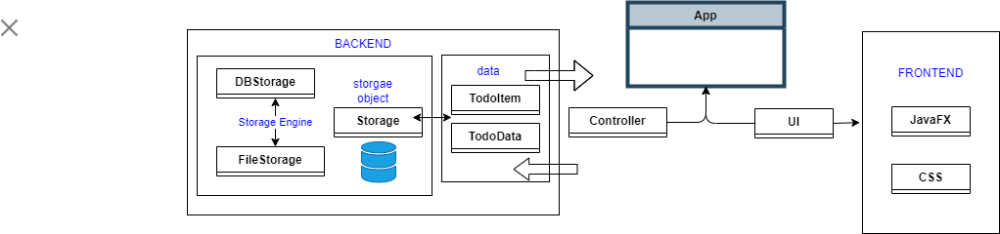
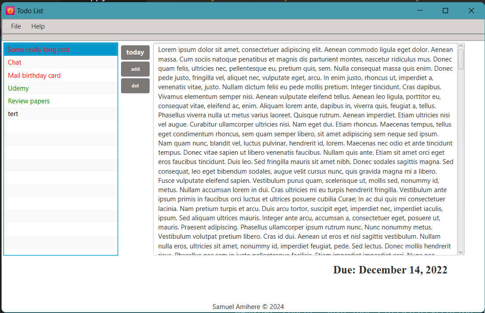
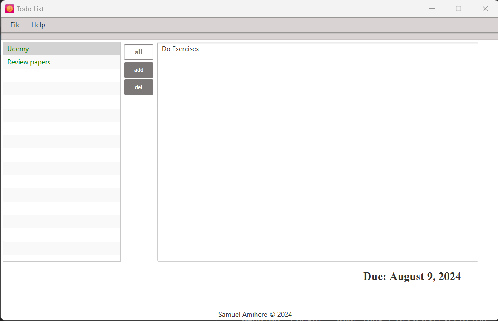
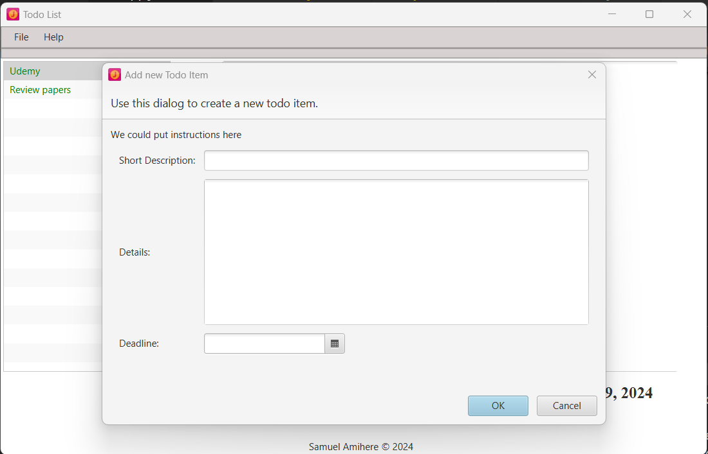
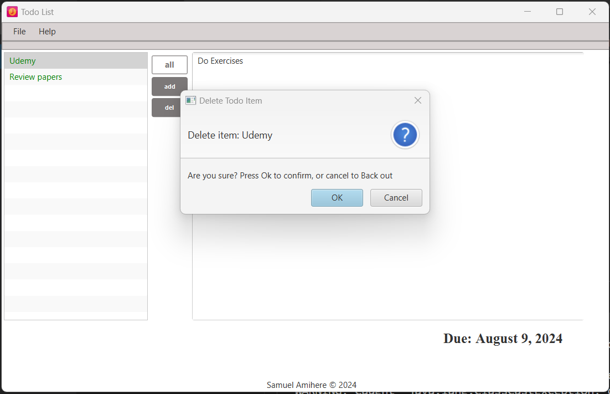

# Welcome to my ToDoApp
This application helps you manage your daily tasks efficiently. You can add, edit, and delete tasks as needed. The user interface is designed to be intuitive and easy to use.

## Stacks
- **Frontend**: JavaFX
- **Backend**: Java
- **Storage**: Optional
    - filestorage
    - sqLite: ToDo
- **Styling**: CSS
- **Version Control**: Git

## 

## Authors

- **Samuel Amihere** - *Initial work* - [Samuel](https://github.com/SamuelAmihere)
